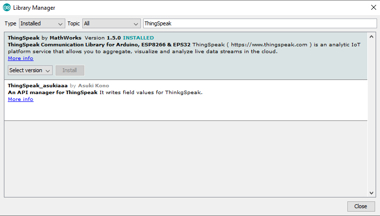

# arduino-analog-sensor-node

Este programa provee la funcionalidad de enviar los datos obtenidos de varios sensores digitales y analógicos a la nube, especificamente a ThingSpeak.
El resultado final lo puedes encontrar en https://thingspeak.com/channels/873646.

## Experimento LDR

Ruta: experimento/experimento.ino

Para obtener el valor promedio de ADC (Vin) se toman 100 muestras cada 50 ms, este valor ADC final estará asociado a un valor promedio de Lux.

Ejemplo:
```
Total: 327
```

## Red completa de sensores

Ruta: final/final.ino

Esta red utiliza un controlador Arduino ESP8266, para lo cual debes instalar las librerías de este controlador siguiendo las instrucciones en la sección https://github.com/esp8266/Arduino#installing-with-boards-manager.

Adicionalmente deberas agregar las siguientes librerias para el manejo de los sensores de temperatura, presión y humedad. Sigue las instrucciones oficiales especificadas para cada libreria.

Guía [Using the Library Manager](https://www.arduino.cc/en/guide/libraries#toc3)
* DHT22 - https://github.com/beegee-tokyo/DHTesp
* ThingSpeak - ver imagen



Guía [Importing a .zip library](https://www.arduino.cc/en/guide/libraries#toc4)
* BMP180 - https://github.com/sparkfun/BMP180_Breakout_Arduino_Library
